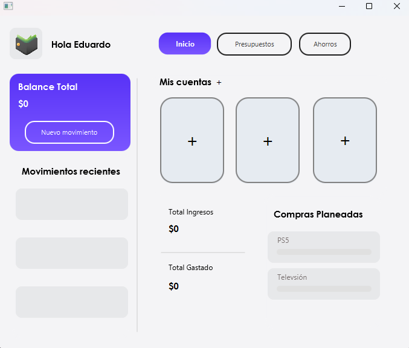
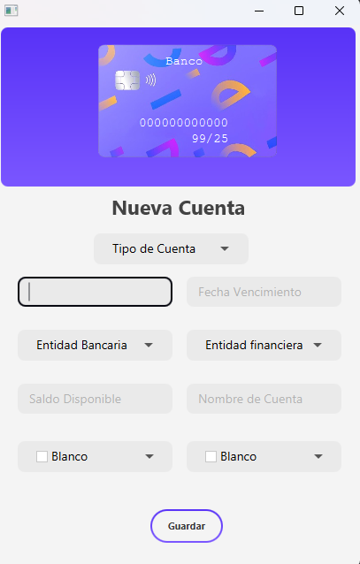
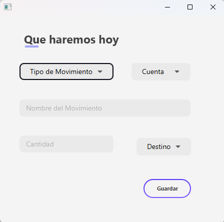
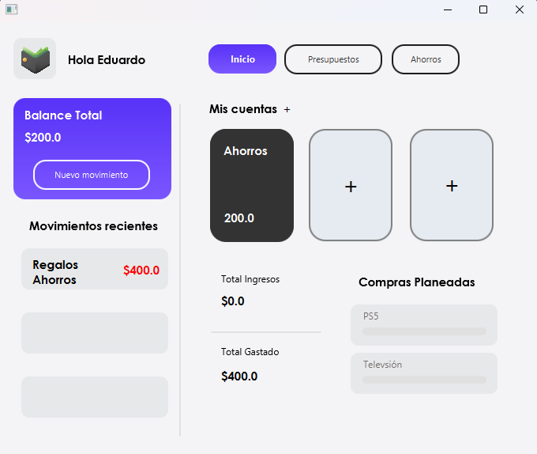

# App de Finanzas Personales

Aplicación de escritorio para gestionar cuentas, movimientos y tarjetas de manera sencilla.

## Tecnologías
- Java 
- Maven
- JavaFX
- CSS para estilos

## Funcionalidades
- Crear nuevas cuentas y tarjetas
- Registrar ingresos, gastos y transacciones entre las cuentas
- Visualizar movimientos
- Generar reportes simples

## Cómo ejecutar
1. Clonar el repositorio: `git clone https://github.com/eduardosotogomez7/app.finanzas.personales.git`
2. Abrir el proyecto en IntelliJ IDEA o Eclipse
3. Ejecutar `Main.java` desde el IDE

## Capturas

